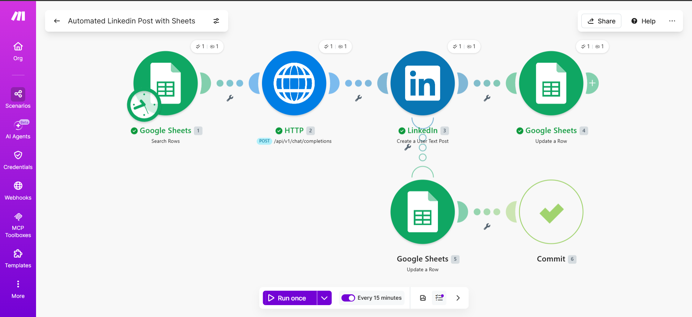

# 🤖 Automated LinkedIn Post with Google Sheets

A [Make.com](https://www.make.com) scenario that turns a Google Sheet into a fully automated LinkedIn content pipeline. Drop a topic and tone into a row, and the scenario writes a post with AI, cleans up the formatting, publishes it to LinkedIn, and marks the row as **Posted** — all on a schedule, with no manual steps.

> **Public scenario link:** [Open in Make](https://eu1.make.com/public/shared-scenario/1Y4MAPOn0mD/integration-google-sheets-option-b)



---

## ✨ What it does

1. **Reads** the next unposted row from a Google Sheet (`Status ≠ Posted`).
2. **Generates** a professional LinkedIn post with an LLM via [OpenRouter](https://openrouter.ai) — strong hook, 3 short paragraphs, a closing question, and 5 hashtags.
3. **Cleans** the text, stripping Markdown symbols (`*`, `#`, `` ` ``) so it reads cleanly on LinkedIn.
4. **Publishes** the post to LinkedIn (public, main feed).
5. **Writes back** `Posted` to the row's **Status** column so it never posts twice.
6. **Handles errors** — if the LinkedIn post fails, the row is marked `Error` instead, and the scenario keeps running.

Runs automatically every 15 minutes (configurable).

---

## 🧩 How the flow is built

| # | Module | Purpose |
|---|--------|---------|
| 1 | **Google Sheets → Search Rows** | Finds the next row where `Status (D) ≠ "Posted"` |
| 2 | **HTTP → Make a Request** | Calls OpenRouter chat completions to write the post |
| 3 | **LinkedIn → Create a User Text Post** | Publishes the cleaned content |
| 4 | **Google Sheets → Update a Row** | Sets `Status = Posted` on success |
| 5 | **Google Sheets → Update a Row** *(error branch)* | Sets `Status = Error` if the post fails |
| 6 | **Commit** *(error branch)* | Lets the scenario continue after handling the error |

The Markdown cleanup happens in module 3's content mapping:

```
{{ replace(2.data.choices[].message.content; "/[*#`]/g"; "") }}
```

---

## 📋 The Google Sheet

Sheet must have these headers in **row 1** (columns A–D):

| A | B | C | D |
|---|---|---|---|
| **Topic** | **Tone** | **Approval** | **Status** |
| The future of AI in marketing | Professional | Yes | |
| Lessons from my first startup failure | Inspirational | Yes | |
| Why remote work boosts productivity | Conversational | Yes | |

**Rules:**
- Leave **Status (D)** *empty* for any row you want posted. Blank = "will post."
- The scenario fills in `Posted` (or `Error`) automatically — don't pre-fill it.
- **Approval (C)** is currently informational only (auto-approve mode). It can later gate posting with a `Approval = Yes` filter.
- **Tone** is free text and is injected straight into the prompt.

---

## 🚀 Setup

### Prerequisites
- A [Make.com](https://www.make.com) account
- A Google account (for Google Sheets)
- A LinkedIn account
- An [OpenRouter](https://openrouter.ai) API key

### Steps
1. **Import the blueprint:** In Make, create a new scenario → ⋯ menu → **Import Blueprint** → upload `Automated Linkedin Post with Sheets.blueprint.json`. *(Or open the [public scenario link](https://eu1.make.com/public/shared-scenario/1Y4MAPOn0mD/integration-google-sheets-option-b) and clone it.)*
2. **Reconnect accounts:** Re-select your own **Google** and **LinkedIn** connections in the modules (the imported ones won't match your account).
3. **Point to your sheet:** In modules 1, 4, and 5, choose your spreadsheet and `Sheet1`.
4. **Add your OpenRouter key:** In module 2 (HTTP), replace `YOUR_OPENROUTER_API_KEY` in the `Authorization` header with your real key.
5. **Set the schedule:** Use the clock on module 1 (e.g. every 15 minutes).
6. **Test:** Add a row with a Topic and Tone, leave Status blank, and click **Run once**.

---

## ⚙️ Configuration notes

- **Model:** `meta-llama/llama-3.1-8b-instruct` via OpenRouter. Swap the `model` value in module 2's body to use any other OpenRouter chat model.
- **Posts per run:** module 1's `Limit` is `1` (one post per cycle). Increase it to post more rows per run.
- **Visibility:** posts are `PUBLIC` on the main feed — change in module 3 if needed.

---

## 🔐 Security

The blueprint in this repo has its API key **redacted** (`YOUR_OPENROUTER_API_KEY`). Never commit real API keys or connection secrets. Add your key only inside Make after importing.

---

## 📄 License

MIT — free to use and adapt.
